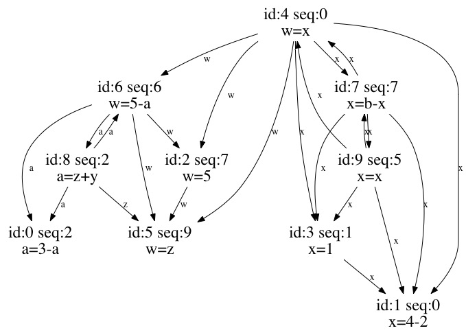

# Local-min exec algo demo report
To rerun: `python exec-demo.py load local-min-rst/instance_space.yaml`

To run with a random instance space: `python exec-demo.py`
## Instance space
```yaml
alphabet: xyzwab
insts:
  0:
    cmds: [a=3-a]
    deps: []
    id: 0
    seq: 2
  1:
    cmds: [x=4-2]
    deps: []
    id: 1
    seq: 0
  2:
    cmds: [w=5]
    deps: [5, 5]
    id: 2
    seq: 7
  3:
    cmds: [x=1]
    deps: [1, 1]
    id: 3
    seq: 1
  4:
    cmds: [w=x]
    deps: [1, 2, 3, 7, 1, 2, 3, 5, 6]
    id: 4
    seq: 0
  5:
    cmds: [w=z]
    deps: []
    id: 5
    seq: 9
  6:
    cmds: [w=5-a]
    deps: [0, 2, 5, 8, 0, 2, 5]
    id: 6
    seq: 6
  7:
    cmds: [x=b-x]
    deps: [1, 3, 4, 9, 1, 3]
    id: 7
    seq: 7
  8:
    cmds: [a=z+y]
    deps: [0, 5, 6, 0, 5]
    id: 8
    seq: 2
  9:
    cmds: [x=x]
    deps: [1, 3, 4, 7, 1, 3, 4]
    id: 9
    seq: 5

```




## Executions
Initial storage `{'x': 1, 'y': 2, 'z': 3, 'w': 4, 'a': 5, 'b': 6}`

Execution Result `{'x': 5, 'y': 2, 'z': 3, 'w': 1, 'a': 5, 'b': 6}`

Execution sequences:
```
00-th: [1, 3, 0, 5, 8, 2, 6, 4, 9, 7]
01-th: [1, 3, 0, 5, 8, 2, 6, 4, 9, 7]
02-th: [0, 5, 8, 1, 3, 2, 6, 4, 9, 7]
03-th: [1, 3, 0, 5, 8, 2, 6, 4, 9, 7]
04-th: [1, 3, 0, 5, 8, 2, 6, 4, 9, 7]
05-th: [5, 2, 0, 8, 1, 3, 6, 4, 9, 7]
06-th: [1, 3, 0, 5, 8, 2, 6, 4, 9, 7]
07-th: [5, 1, 3, 0, 8, 2, 6, 4, 9, 7]
08-th: [5, 2, 1, 3, 0, 8, 6, 4, 9, 7]
09-th: [0, 5, 8, 2, 6, 1, 3, 4, 9, 7]
```
